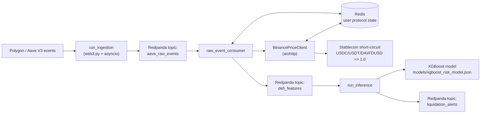

# defi-streaming-risk

[](https://www.python.org/)
[](https://github.com/MRIKSRJL/defi-streaming-risk/actions/workflows/ci.yml)
[](https://www.terraform.io/)
[](https://aws.amazon.com/)
[](https://docs.docker.com/compose/)
[](https://redpanda.com/)
[](https://redis.io/)
[](https://xgboost.readthedocs.io/)

An institutional-grade, real-time Web3 MLOps pipeline for DeFi liquidation risk monitoring.

This repository ingests live Aave V3 events on Polygon, maintains streaming user state, enriches with asynchronous market prices, computes risk features, and performs real-time XGBoost inference to emit liquidation alerts.

---

## Why this project matters

- **Real-time first:** event-driven ingestion and inference, not batch-only analytics.
- **Production posture:** strict schemas, retries/reconnects, Redis-backed state, CI tests, IaC deployment.
- **MLOps complete loop:** synthetic data generation, training notebook, persisted model, online scoring.

---

## Architecture

### Data lifecycle

1. **Web3 / Polygon ingestion**
   - `src.apps.run_ingestion` listens to Aave V3 pool events over WebSocket.
   - Events are decoded/validated and published to `aave_raw_events`.

2. **Streaming backbone**
   - Redpanda (Kafka-compatible) decouples ingestion, processing, and inference.

3. **Stateful processing + async oracle pricing**
   - `src.processing.raw_event_consumer` updates user state in Redis.
   - `BinancePriceClient` fetches token USD prices asynchronously (aiohttp) and caches them in Redis (`price:{symbol}`, TTL 60s).
   - **Stablecoin short-circuit logic:** `USDC`, `USDT`, `DAI`, `FDUSD` return `1.0` immediately to reduce latency and oracle dependency for pegged assets.

4. **Feature extraction**
   - `extract_features` computes `current_health_factor`, `debt_to_collateral_ratio`, and other model inputs using state + oracle data.

5. **Online ML inference**
   - `src.apps.run_inference` consumes `defi_features`, loads `models/xgboost_risk_model.json`, scores with `predict_proba`, and publishes high-risk alerts to `liquidation_alerts`.

### Architecture diagram



---

## Tech stack

| Layer | Technologies |
|---|---|
| Language/runtime | Python 3.11+, asyncio |
| Blockchain I/O | web3.py, websockets |
| Streaming | Redpanda, confluent-kafka |
| State/cache | redis.asyncio |
| Oracle pricing | aiohttp + Binance public API |
| ML | pandas, NumPy, scikit-learn, XGBoost |
| Testing | pytest, pytest-asyncio |
| CI/CD | GitHub Actions |
| Infrastructure | Docker Compose, Terraform, AWS EC2 |

---

## Setup (local)

### 1) Clone + virtual environment

```bash
git clone https://github.com/MRIKSRJL/defi-streaming-risk.git
cd defi-streaming-risk
python -m venv .venv
```

PowerShell:

```powershell
.\.venv\Scripts\Activate.ps1
```

Linux/macOS:

```bash
source .venv/bin/activate
```

### 2) Install dependencies

```bash
pip install -r requirements.txt
```

### 3) Configure env

```bash
copy .env.example .env
```

Set at least:
- `POLYGON_WS_URL`
- `AAVE_V3_POOL_ADDRESS`
- `KAFKA_BOOTSTRAP_SERVERS`

### 4) Start infra + topics

```bash
docker compose up -d
python scripts/bootstrap_topics.py
```

Redpanda Console: [http://localhost:8080](http://localhost:8080)

---

## Model training (MLOps pipeline)

### Generate synthetic training data

```bash
python -m src.ml.generate_dataset
```

Creates `data/synthetic_aave_data.csv` with realistic liquidation dynamics.

### Train XGBoost model

Run notebook:
- `notebooks/01_train_xgboost.ipynb`

Outputs:
- `models/xgboost_risk_model.json`

---

## Running the real-time pipeline

Run in three terminals:

```bash
set PYTHONPATH=.
python -m src.apps.run_ingestion
```

```bash
set PYTHONPATH=.
python -m src.processing.raw_event_consumer
```

```bash
set PYTHONPATH=.
python -m src.apps.run_inference
```

Linux/macOS: replace `set` with `export`.

---

## Mock testing (Crash Tests)

Use `scripts/inject_test_event.py` to inject synthetic stress events directly into `aave_raw_events`.

This lets you validate:
- state transitions under extreme borrowing/debt,
- oracle-enhanced feature behavior,
- inference escalation into `HIGH`/`CRITICAL`,
- alert propagation into `liquidation_alerts`.

It is ideal for deterministic pipeline verification without waiting for rare on-chain conditions.

---

## Testing & CI/CD

### Unit tests

The test suite includes async feature extraction validation with mocked oracle responses:
- `tests/test_feature_extractor.py`

Run locally:

```bash
pytest tests/
```

### GitHub Actions pipeline

Workflow file:
- `.github/workflows/ci.yml`

Triggers:
- `push` to `main`
- `pull_request` targeting `main`

Pipeline:
1. Checkout
2. Setup Python 3.11
3. Install dependencies
4. Run tests (`pytest tests/`)

---

## Deployment (IaC / AWS)

Terraform configuration in `terraform/` deploys an MVP stack to a single EC2 host in `eu-central-1`:

- VPC + public subnet + IGW + route table
- Security group (SSH `22`, Redpanda Console `8080`, internal Kafka `9092`, internal Redis `6379`)
- EC2 `t3.medium` (Ubuntu 24.04)
- `user_data` bootstrap:
  - installs Docker/Compose, Python 3.11, Git
  - clones repo
  - runs `docker compose up -d`
  - installs Python requirements
  - provisions and enables **systemd services**:
    - `defi-ingestion.service`
    - `defi-processing.service`
    - `defi-inference.service`

This gives automatic restarts and better operational reliability than `nohup`.

### Terraform commands

```bash
cd terraform
terraform init
terraform plan
terraform apply
```

Outputs:
- `instance_public_ip`
- `redpanda_console_url`

After provisioning, update `.env` on the instance with real credentials (especially `POLYGON_WS_URL`) and restart services if needed.

---

## Project structure (high level)

```text
defi-streaming-risk/
├── .github/workflows/ci.yml
├── docker-compose.yml
├── terraform/
├── schemas/
├── src/
│   ├── apps/
│   ├── infra/
│   ├── ingestion/
│   ├── processing/
│   └── ml/
├── tests/
├── scripts/
├── notebooks/
├── data/
└── models/
```

---

## License

Licensed under MIT. See `LICENSE`.
