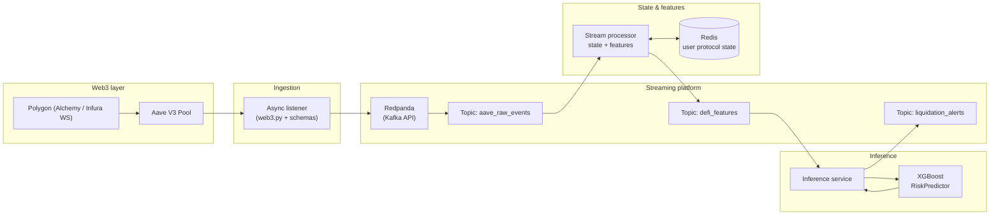

# defi-streaming-risk

[](https://www.python.org/)
[](https://docs.docker.com/compose/)
[](https://redpanda.com/)
[](https://redis.io/)
[](https://xgboost.readthedocs.io/)

**Institutional-grade, real-time MLOps pipeline for Web3 / DeFi:** live Aave V3 protocol events on Polygon are ingested over WebSockets, streamed through Redpanda (Kafka-compatible), aggregated into per-user financial state in Redis, enriched into risk features on the fly, and scored in real time by a trained **XGBoost** classifier—with high-risk outcomes emitted as structured liquidation alerts.

Designed for engineers who care about **correct streaming semantics**, **strict schemas**, **observable pipelines**, and **end-to-end ML deployment**—not batch-only notebooks disconnected from production.

---

## Architecture

End-to-end **data lifecycle**:

1. **Web3 ingestion (Polygon)** — Async WebSocket client connects to an RPC provider (e.g. Alchemy). The listener subscribes to `eth_subscribe` logs for the **Aave V3 Pool** contract, decodes Borrow / Repay / Supply / Withdraw / LiquidationCall events with **web3.py**, validates them against **Pydantic** schemas, and publishes normalized JSON to Kafka.

2. **Streaming backbone (Redpanda)** — Raw events land on a durable log (`aave_raw_events`). Downstream services consume at their own pace with consumer groups, enabling replay and horizontal scale without coupling producers to consumers.

3. **Stateful stream processing** — A processor consumes raw events, loads or creates **per-user protocol state** in **Redis**, updates collateral / debt / health metrics from each event, derives a **risk feature vector**, and publishes features to a dedicated topic (`defi_features` by default).

4. **Real-time ML inference** — An inference service consumes feature vectors, runs **`predict_proba`** on a trained **XGBoost** model (`models/xgboost_risk_model.json`), maps probability to a risk tier, and publishes **liquidation alerts** to `liquidation_alerts` when thresholds are met.

5. **Observability** — Redpanda Console (bundled in Docker Compose) provides topic inspection; structured logging ties each stage to user addresses and Kafka keys for traceability.

### Architecture diagram



---

## Tech stack

| Area | Technologies |
|------|----------------|
| Language & runtime | **Python 3.11+**, asyncio |
| Schemas & config | **Pydantic v2**, YAML |
| Blockchain | **web3.py**, WebSockets (`websockets`) |
| Streaming | **Redpanda** (Kafka-compatible), **confluent-kafka** (Producer / Consumer) |
| State | **Redis** (`redis.asyncio`) |
| ML | **XGBoost**, **scikit-learn**, **pandas**, **NumPy** |
| Data science UX | **Jupyter**, **matplotlib** |
| Packaging & infra | **Docker**, **Docker Compose** |

---

## Prerequisites

- **Docker** and **Docker Compose** (for Redpanda, Console, and Redis).
- **Python 3.11+** and a virtual environment (`venv` or equivalent).
- A **Polygon mainnet WebSocket URL** (e.g. [Alchemy](https://www.alchemy.com/) or Infura) for live ingestion.
- Optional: topic bootstrap uses `configs/topics.yaml` (see **Running the pipeline**).

---

## Setup

### 1. Clone and virtual environment

```bash
git clone https://github.com/MRIKSRJL/defi-streaming-risk.git defi-streaming-risk
cd defi-streaming-risk
python -m venv .venv
```

**Windows (PowerShell)**

```powershell
.\.venv\Scripts\Activate.ps1
```

**macOS / Linux**

```bash
source .venv/bin/activate
```

### 2. Install dependencies

```bash
pip install -r requirements.txt
```

### 3. Environment variables

Copy the example env file and fill in secrets:

```bash
copy .env.example .env
```

On Unix:

```bash
cp .env.example .env
```

Edit `.env` at minimum:

| Variable | Purpose |
|----------|---------|
| `POLYGON_WS_URL` | `wss://polygon-mainnet.g.alchemy.com/v2/YOUR_API_KEY` |
| `AAVE_V3_POOL_ADDRESS` | Aave V3 Pool on Polygon (default in `.env.example`) |
| `KAFKA_BOOTSTRAP_SERVERS` | Usually `localhost:9092` with local Compose |

Additional variables used by processing / inference (defaults match local dev):

| Variable | Purpose |
|----------|---------|
| `REDIS_URL` | e.g. `redis://localhost:6379/0` |
| `FEATURES_TOPIC` | Default `defi_features` |
| `LIQUIDATION_ALERTS_TOPIC` | Default `liquidation_alerts` |

### 4. Start infrastructure

```bash
docker compose up -d
```

Bootstrap Kafka/Redpanda topics (from repo root):

```bash
python scripts/bootstrap_topics.py
```

Optional: open **Redpanda Console** at [http://localhost:8080](http://localhost:8080) to verify topics.

---

## Training the model (Phase 1)

Synthetic data keeps the MLOps loop reproducible without scraping historical chain archives.

### 1. Generate synthetic dataset

From the **repository root**:

```bash
python -m src.ml.generate_dataset
```

This writes **`data/synthetic_aave_data.csv`** (~10k rows) with features aligned to the streaming pipeline: `current_health_factor`, `debt_to_collateral_ratio`, `recent_borrow_count`, and label `is_liquidated`.

> **Note:** `data/*.csv` and `models/*.json` are gitignored by design; regenerate artifacts locally or in CI.

### 2. Train XGBoost in Jupyter

1. Install Jupyter if you have not already (`pip install -r requirements.txt`).
2. Start Jupyter from the repo root (or open the notebook in VS Code / Cursor).
3. Open **`notebooks/01_train_xgboost.ipynb`**, run all cells.

The notebook:

- Loads the CSV  
- Splits train/test  
- Trains **`xgb.XGBClassifier`**  
- Prints **classification report** and **ROC-AUC**  
- Saves the model to **`models/xgboost_risk_model.json`**

The inference service loads this file automatically via **`src/ml/predictor.py`**.

---

## Running the pipeline (Phase 2)

With Docker running, topics bootstrapped, `.env` configured, and **`models/xgboost_risk_model.json`** present, start **three concurrent processes** (three terminals), each with the project root on **`PYTHONPATH`**:

**Terminal 1 — ingestion (WebSocket → raw topic)**

```bash
set PYTHONPATH=.
python -m src.apps.run_ingestion
```

**Terminal 2 — stream processing (raw topic → Redis + features topic)**

```bash
set PYTHONPATH=.
python -m src.processing.raw_event_consumer
```

**Terminal 3 — ML inference (features topic → alerts topic)**

```bash
set PYTHONPATH=.
python -m src.apps.run_inference
```

**macOS / Linux** (equivalent):

```bash
export PYTHONPATH=.
python -m src.apps.run_ingestion
```

```bash
export PYTHONPATH=.
python -m src.processing.raw_event_consumer
```

```bash
export PYTHONPATH=.
python -m src.apps.run_inference
```

Alternatively, Makefile helper for ingestion only:

```bash
make run-ingestion
```

High-risk predictions log **`LIQUIDATION ALERT`** warnings and publish JSON alerts to **`liquidation_alerts`** for downstream dashboards or alerting.

---

## Project structure

```
defi-streaming-risk/
├── configs/
│   └── topics.yaml              # Redpanda topic definitions (bootstrap script)
├── data/
│   └── .gitkeep                 # Synthetic CSV generated locally
├── models/
│   └── .gitkeep                 # Trained XGBoost JSON (generated locally)
├── notebooks/
│   └── 01_train_xgboost.ipynb   # Train & evaluate XGBoost, save model
├── schemas/
│   ├── raw_events.py            # AaveRawEvent
│   ├── state_models.py          # UserProtocolState
│   ├── feature_vectors.py       # RiskFeatureVector
│   └── alert_models.py          # LiquidationAlert
├── scripts/
│   └── bootstrap_topics.py      # Create topics via AdminClient
├── src/
│   ├── apps/
│   │   ├── run_ingestion.py     # Entry: ingestion
│   │   └── run_inference.py     # Entry: inference
│   ├── ingestion/
│   │   ├── listener.py          # WS subscription + Kafka produce
│   │   └── decoder.py           # Log decode → AaveRawEvent
│   ├── processing/
│   │   ├── raw_event_consumer.py
│   │   ├── state_updater.py
│   │   └── feature_extractor.py
│   ├── ml/
│   │   ├── generate_dataset.py
│   │   └── predictor.py         # Loads XGBoost, predict_proba
│   └── infra/
│       ├── kafka/               # Async producer / consumer
│       ├── redis/               # Async Redis + key helpers
│       └── web3/                # WS client, ABI registry
├── docker-compose.yml           # Redpanda + Console + Redis
├── Makefile
├── requirements.txt
└── README.md
```

---

## License

Add a `LICENSE` file to match your chosen terms (e.g. MIT, Apache-2.0).

---

<p align="center">
  <sub>Built as a portfolio-grade reference for real-time DeFi analytics and streaming ML.</sub>
</p>
